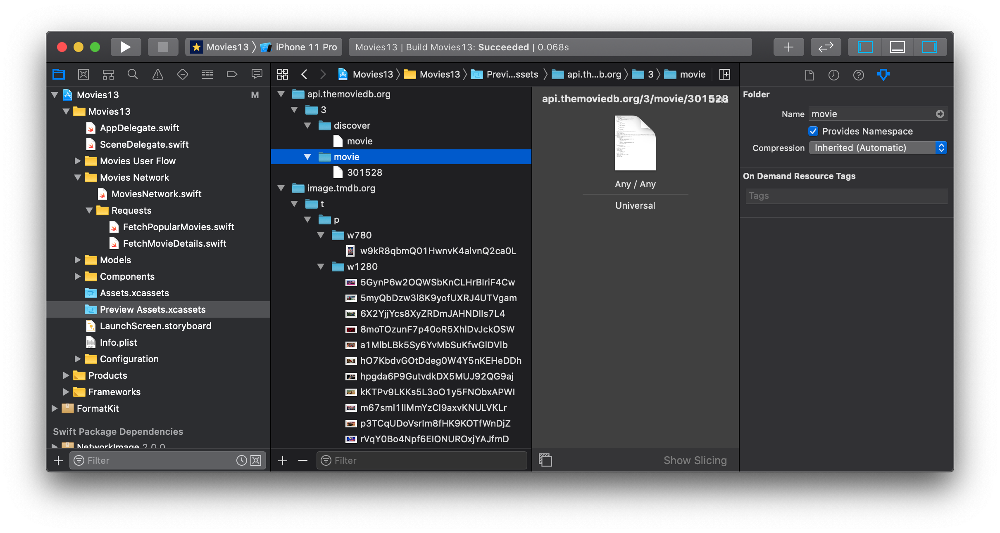

# NetworkKit
An abstraction layer on top of `URLSession`, NetworkKit provides a clear way to organise and structure your network API requests. It also works seemlessly with Xcode Previews to allow you to preview mock API response data.

## Network
The `Network` protocol is a way to share common properties and settings between requests that share the same service. You can use network to set properties such as a common base URL, headers, error structures, or encoding/decoding settings.
```swift
class MoviesNetwork: Network {
    let baseURL: URL = .init(string:"https://api.themoviedb.org/3/")!
}
```
> It's recommended that you implement your `Network` as an `ObservableObject` and pass it through your SwiftUI view hierarchy with `environmentObject`.

## Requests
Once you have a `Network` setup you can makes requests by implementing the `NetworkRequest` protocol.
```swift
struct FetchPopularMovies: NetworkRequest {
    let method: HTTPMethod = .get
    let path: String = "discover/movie"
}
```
Now you can perform this request on your network by using the `request` method.
```swift
MoviesNetwork().request(FetchPopularMovies())
```

The `request` method returns a [Combine](https://developer.apple.com/documentation/combine) `Publisher` that publishes `Data` by default.

### Responses
The response type of a `NetworkRequest` can be customised using the `Response` associated type.
```swift
struct FetchPopularMovies: NetworkRequest {
    let method: HTTPMethod = .get
    let path: String = "discover/movie"

    struct Response: Decodable {
        let page: Int
        let results: [Movie]
    }
}
```
If you have a model that matches your response type you can just assign it directly to the associated type.
```swift
struct FetchMovieDetails: NetworkRequest {
    let method: HTTPMethod = .get
    let path: String

    init(movieID: Int) {
        path = "movie/" + String(movieID)
    }

    typealias Response = MovieDetails
}
```
If the `Response` type is `Decodable` the response will be automatically decoded and the `Publisher` returned from `request` will instead publish that decoded response.
```swift
MoviesNetwork()
    .request(FetchMovieDetails(movieID: 42))
    .assertNoFailure()
    .sink { (movieDetails) in
        // Use decoded MovieDetails
    }
```
> **Note:**  By default, NetworkKit supports `Decodable`, `UIImage`, and `Data` response types. You can support custom response types by implementing `response(on: Network, for: Data) throws -> Response` in your `NetworkRequest`.

### Parameters
You can provide parameters to your requests by implementing the `parameters` property on your `NetworkRequest` as an encodable object.
```swift
struct FetchPopularMovies: NetworkRequest {
    let method: HTTPMethod = .get
    let path: String = "discover/movie"
    let parameters: Parameters
    let encoding: ParameterEncoding = .url

    init(sortBy: String) {
        parameters = Parameters(sortBy: sortBy)
    }

    struct Parameters: Encodable {
        let sortBy: String
    }
}
```
You can customise the encoding destination of your parameters by implementing the `encoding` property on the request.

> **Note:** You can customise `Date` encoding and decoding by implementing the `dateEncodingStrategy` and `dateDecodingStrategy` properties on your `Network`.

## Error Handling
The publisher returned from `Network.request` publishes a `NetworkError` whenever an error occurs. `NetworkError` is an `enum` that contains two cases: `local` and `remote`. Local errors are errors that have occured locally on the device (such as encoding errors or connection issues). Remote errors are errors returned from a remote HTTP service. These contain a `statusCode` and a `content` object which contains the data of the failed request. You can customise the type of this content object by setting the `ErrorContent` associated type of your `Network`.
```swift
class MoviesNetwork: Network, ObservableObject {
    let baseURL: URL = .init(string:"https://api.themoviedb.org/3/")!

    struct ErrorContent: Decodable {
        let code: Int
        let message: String
    }
}
```
If the `ErrorContent` type is `Decodable` the data from the failed request will be automatically decoded to that type.
```swift
MoviesNetwork()
    .request(FetchPopularMovies())
    .catch { error in
        switch error {
        case .local(let localError):
            print(localError)
        case .remote(let statusCode, let content):
            print(content.message)
    }
}
```
> **Note:** If your `ErrorContent` type doesn't implement `Decodable` you can map the returned data directly by implementing `Network.errorContent(for: Data) throws -> ErrorContent`.

## Preview Modes
A `Network` is capable so showing mock preview data that is compatible with Xcode Previews. You can set the preview mode of your `Network` by calling the `preview(mode: NetworkPreviewMode)` method on your network. If the preview mode is set to `success` the network will search the app's assets for an asset with that request's `assetPreviewName`. Add JSON files for your `Decodable` requests and image assets for your `UIImage` requests. You can also use any data asset for other response types.

By default the asset name will be the full path of the request without the scheme (so `https://api.themoviedb.org/3/movies` become `api.themoviedb.org/3/movies`). It's recommend that you use assets groups with `Provides Namespace` enabled to organise your preview assets.

If you set the preview mode to `loading` the network will load indefinitely and never return a response for any requests. Setting the preview mode to `failure` allows you to specify an error that the network will return for every request. If you don't want any preview behaviour you can explicitly set the preview mode to `noPreview`.

> **Note:** By default, a `Network` will use the `automatic` preview mode which will detect when the network is being used in an Xcode preview and use the `success` mode in that case, otherwise it with use the `noPreview` mode.

If you've passed your `Network` through your SwiftUI view layer using `environmentObject`, it's easy to override the network with a preview network in your Xcode Previews.
```swift
struct PopularMoviesScreen_Previews: PreviewProvider {
    static var previews: some View {
        Group {
            PopularMoviesScreen()
                .environmentObject(MoviesNetwork().preview(mode: .success))

            PopularMoviesScreen()
                .environmentObject(MoviesNetwork().preview(mode: .loading))

            PopularMoviesScreen()
                .environmentObject(MoviesNetwork().preview(mode: .failure()))
        }
        .onAppear { UIView.setAnimationsEnabled(false) }
    }
}
```
